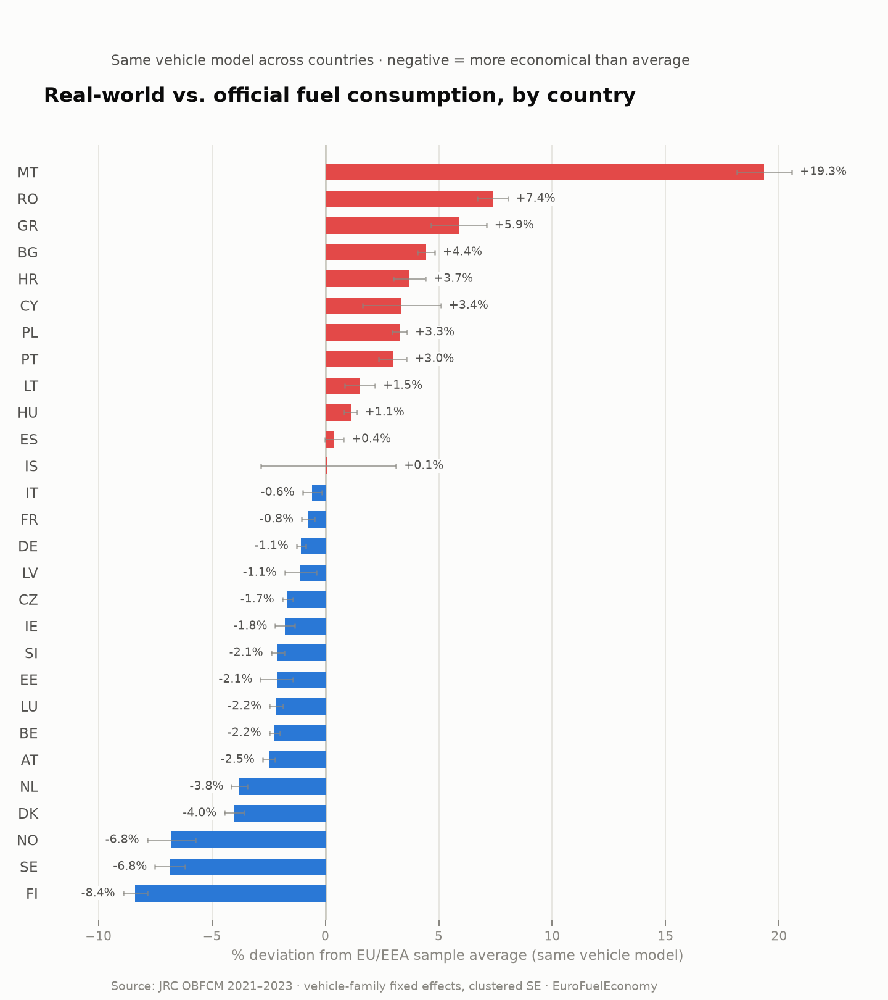

# EuroFuelEconomy

Which European drivers get the most out of their car's fuel, and which get the least?

This project compares **real-world fuel consumption vs. the official (WLTP) rating** for the
same car models registered across EU/EEA countries, to estimate how much of the gap between
"what the sticker promises" and "what people actually burn" is explained by *where* the car is
driven rather than *which* car it is.

The original motivation: recurring public appeals in Portugal to drive more economically during
fuel-price spikes — is there actually room for that, or are Portuguese drivers already closer to
the official rating than most of Europe?

## How it works, in one paragraph

Naively comparing average consumption per country mixes together two different things: driving
style, and which cars each country happens to buy (SUVs vs. hatchbacks, diesel vs. petrol,
automatic vs. manual). To isolate the driving-style part, this project uses the EU's
[OBFCM](https://data.jrc.ec.europa.eu/dataset/9528c82b-37fa-4da3-9b6b-b54eaf0ba4ac) (On-Board
Fuel Consumption Monitoring, Reg. (EU) 2021/392) dataset, which logs real lifetime fuel use and
distance per individual vehicle, and compares the **same vehicle family** across countries using
a fixed-effects regression. See [docs/METHODOLOGY.md](docs/METHODOLOGY.md) for the full
reasoning, data caveats, and model specification.

## Data source

- **JRC OBFCM, M1 passenger cars, 2021–2023** (CC BY 4.0, European Commission Joint Research
  Centre) — one row per unique vehicle, ~7.7M vehicles across 29 countries.
  [Dataset page](https://data.jrc.ec.europa.eu/dataset/9528c82b-37fa-4da3-9b6b-b54eaf0ba4ac)
- The raw CSV (~2.1GB) is **not** committed to this repo — fetch it with
  `python scripts/00_download_data.py`. It is redistributed by the JRC under CC BY 4.0; this
  repo only contains code that processes it.

## Repo structure

```
dataset/    raw data (gitignored, fetched by scripts/00_download_data.py)
db/         local DuckDB database (gitignored) + exported result CSVs (tracked)
scripts/    pipeline: download -> build database -> model -> chart
docs/       methodology, data dictionary notes
app/        Streamlit app to browse the country ranking interactively
```

The database (`db/obfcm.duckdb`) is the boundary between the data pipeline and any application
built on top of it: an app should query that file (or the exported result tables in `db/*.csv`)
and never re-parse the raw CSV or rerun the regression itself.

## Quickstart

```bash
pip install -r requirements.txt
python scripts/00_download_data.py       # fetch the ~2.1GB CSV (once)
python scripts/01_build_database.py      # build db/obfcm.duckdb (~1min)
python scripts/02_model_country_effects.py PT   # country effects vs. Portugal
python scripts/02_model_country_effects.py EU   # country effects vs. EU/sample average
python scripts/03_chart_country_effects.py      # renders docs/images/country_effects_*.png
```

## Interactive app

```bash
pip install -r app/requirements.txt
streamlit run app/app.py
```

Browse the country ranking, switch between the Portugal and EU-average reference, and hover
bars for exact percentages and confidence intervals. It only reads the small exported tables
in `db/*.csv` (see [Repo structure](#repo-structure)) — no need to build the full database
just to run it.

## Current results (preview)

Fixed-effects model, same vehicle family (`EEA_VFN`) across countries, ICEV + non-plug-in HEV,
≥3,000 km lifetime distance, real/WLTP ratio in [0.7, 2], standard errors clustered by vehicle
family. Coefficients read as % more/less real-world fuel consumption than the reference, for
the same car.

<picture>
  <source media="(prefers-color-scheme: dark)" srcset="docs/images/country_effects_dark.png">
  
</picture>

Referenced against the **EU/EEA sample average** (unweighted across countries): Finland,
Sweden and Norway are the most economical relative to the same car elsewhere (−7 to −8%);
Malta, Romania and Greece the least (+6 to +19%). **Portugal sits at +3.0%**, i.e. slightly
*less* economical than the cross-country average for the same car — modestly undercutting the
"Portuguese drivers are wasteful" framing behind the original motivation, though see the
caveats below before reading too much into the ranking's middle.

Also available referenced directly against Portugal
([db/country_effects_ref_PT.csv](db/country_effects_ref_PT.csv)) — useful while validating the
pipeline, since every coefficient there reads as "% vs. Portugal" directly. Full EU-average
ranking: [db/country_effects_ref_EU.csv](db/country_effects_ref_EU.csv). Model summary, sample
sizes, and interpretation caveats: [docs/METHODOLOGY.md](docs/METHODOLOGY.md).

**This is phase 1 (fixed-effects country ranking) — it identifies *that* a gap exists, not
*why*.** The country effect still mixes actual driving style with road type, congestion, speed
limits, terrain, climate, and private-vs-company-car mix. A planned phase 2 regresses these
country effects against country-level covariates (temperature, urbanization, motorway density,
speed limits, company-car share) to see how much of the gap that explains.

## License

Code: MIT, see [LICENSE](LICENSE). Data: CC BY 4.0 by the European Commission JRC, not
redistributed here — see [Data source](#data-source).
